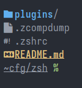
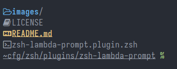
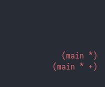
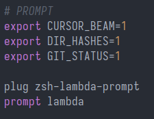

# Lambda Prompt
My prefered zsh prompt



## Installation
Install `bluedragon1221/zsh-lambda-prompt` with your favorite zsh-plugin manager.

Then, add the following line to your `~/.zshrc`:
```zsh
prompt lambda
```

## Configuration
Currently, there are two configuration options.

`$CURSOR_BEAM` determines if you want the prompt to override the cursor shape.
This will also keep the cursor a beam after you open a program that changes it (like neovim).
`1` to enable, or `0` to disable

`$DIR_HASHES` determines if you want some default [named directories](https://unix.stackexchange.com/questions/723248/how-can-one-modify-the-named-directory-hash-table-by-creating-appropriate-shell).
`1` to enable, or `0` to disable

`$GIT_STATUS` enable or disable git status on the right prompt.
`1` to enable or `0` to disable

## Screenshots
Deals with long paths gracefully:


Nice git status on the right prompt:


Configuration Options:

